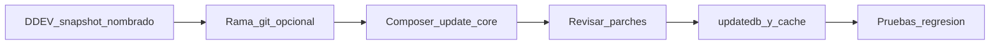

# Plan: actualizar a la última Drupal 10.x

## Situación actual

- **Core bloqueado:** [`drupal/composer.lock`](drupal/composer.lock) tiene `drupal/core` en **10.4.4**.
- **Restricciones en Composer:** [`drupal/composer.json`](drupal/composer.json) usa `drupal/core-recommended`, `drupal/core-composer-scaffold` y `drupal/core-dev` en **`^10.4`**, lo que **ya permite** cualquier 10.x &lt; 11 (por ejemplo 10.5.x o 10.6.x) sin cambiar esas líneas, siempre que no haya conflictos de dependencias.
- **PHP:** el proyecto exige **`>=8.2`**, compatible con las últimas 10.x; conviene alinear con lo que use DDEV/CI.
- **Parches Composer:** hay varios parches en contrib y **uno sobre `drupal/core`** (issue antigua, archivo de 2019 en [`drupal/composer.json`](drupal/composer.json) líneas 149–151). Es el punto más delicado: al saltar varias minors, puede **dejar de aplicarse, fallar al aplicar o provocar regresiones**; hay que validarlo explícitamente tras el `composer update`.

## Objetivo de esta fase

Llevar el proyecto a la **última versión estable de Drupal 10** que resuelva Composer (p. ej. línea 10.6.x si ya está publicada en el momento de ejecutar el plan), **sin** en este mismo paso cambiar restricciones a Drupal 11.

## Pasos recomendados

### 1. Snapshot DDEV (antes de nada)

En la raíz del proyecto donde esté configurado DDEV (donde exista `.ddev/config.yaml`):

1. **Crear el snapshot** (incluye la base de datos del proyecto; es el punto de restauración más rápido en local):


```bash
   ddev snapshot --name next-starterkit-pre-d10-core-2026-05-13


```

2. **Convención de nombre** (fácil de localizar en listados): `next-starterkit-pre-d10-core-AAAA-MM-DD`
   - Prefijo del repo/proyecto + propósito (`pre-d10-core`) + **fecha ISO** del día en que haces la actualización.
   - Si hacéis varios intentos el mismo día, añad sufijo: `-v2` o `-composer`.

3. **Comprobar que existe:** `ddev snapshot --list` (debe aparecer el nombre elegido).

4. **Restaurar si algo sale mal:** `ddev restore-snapshot next-starterkit-pre-d10-core-2026-05-13` (ajusta al nombre real que usaste).

Después del snapshot: copia opcional de `sites/default/files` si necesitáis backup de medios fuera de DDEV, y rama git dedicada (p. ej. `drupal-10-latest`) para aislar el cambio de `composer.lock`.

### 2. Información previa (solo lectura / release notes)

- Revisar notas de versión entre **10.4 → última 10.x** en [Drupal core releases](https://www.drupal.org/project/drupal/releases) (cambios de API, deprecaciones y bugs corregidos).
- Opcional pero útil: instalar temporalmente **Upgrade Status** en local para ver deprecaciones que afecten a módulos custom y preparar el **siguiente** plan (Drupal 11).

### 3. Actualización con Composer

- En el directorio [`drupal/`](drupal/), ejecutar una actualización acotada al núcleo y toolchain alineado, por ejemplo:
  - `composer update "drupal/core-*" "drush/drush" --with-all-dependencies`
- Si Composer **no** sube a la última 10.x por conflictos, revisar el mensaje (`composer why-not drupal/core-recommended <versión-desada>`) y ajustar **solo** el paquete que bloquee (contrib o `php` en `composer.json`), evitando subidas mayores no deseadas.

### 4. Parches

- Tras el update, comprobar que **`composer install` / `composer update` no fallen** por parches.
- **Parche de core (2019):** verificar en [drupal.org/node/3002532](https://www.drupal.org/node/3002532) si el fix ya está en core; si está incluido, **eliminar el parche** del `composer.json` y volver a ejecutar Composer.
- Repetir revisión rápida para el resto de parches (subrequests, decoupled_router, paragraphs, graphql, webform_rest).

### 5. Actualización de base de datos y caché

- `drush updatedb` (o equivalente vía UI) y resolver cualquier hook de update pendiente.
- `drush cache:rebuild` (y limpieza de OPcache en el entorno si aplica).

### 6. Alineación de metadatos (deuda útil antes del plan Drupal 11)

No es estrictamente obligatorio para “última 10.x”, pero reduce sorpresas en el **segundo** plan:

- Perfil [`drupal/web/profiles/custom/basic/basic.info.yml`](drupal/web/profiles/custom/basic/basic.info.yml) declara `core_version_requirement: ^9` y lista módulos/temas legacy (`ckeditor`, `bartik`, `seven`). En Drupal 10+ esto es inconsistente con un core 10.4+; conviene **actualizar el perfil** (requisito de core y dependencias) cuando abordéis D11 o limpieza de instalación.
- Módulos custom en [`drupal/web/modules/custom/*/`](drupal/web/modules/custom/) usan en su mayoría `^9 || ^10`; para D11 hará falta ampliar a `^10 || ^11` (eso queda **fuera** de este plan salvo que queráis unificar ya el requisito en 10.x).

### 7. Pruebas de regresión (mínimo manual)

Priorizar flujos que este starter usa de forma intensiva:

- **JSON:API / GraphQL** (`graphql`, `graphql_compose`, parche en `drupal/graphql`).
- **Next.js / preview** (`drupal/next`, `graphql_compose_preview`, `decoupled_router` + parche).
- **OAuth** (`simple_oauth`).
- **Elasticsearch** (`elasticsearch_helper` + cliente `elasticsearch/elasticsearch`).
- **Webform / webform_rest** (incluido el parche).
- **Temas admin:** [`drupal/web/themes/custom/wunder_claro/`](drupal/web/themes/custom/wunder_claro/) (ya declara `^10 || ^11`).

### 8. Entrega

- Commit con `composer.lock` (y solo los cambios necesarios en `composer.json`, p. ej. eliminación de parche de core obsoleto).
- Breve nota interna: versión final de core y lista de parches eliminados o sustituidos.

## Qué dejar explícitamente para el “otro plan” (Drupal 11)

- Cambiar `drupal/core-recommended`, `core-composer-scaffold`, `core-dev` a **`^11`** (o la serie estable que corresponda).
- Revisar **PHP mínimo** de Drupal 11 (normalmente **8.3+**), Symfony y Twig según la guía oficial de actualización 10 → 11.
- Volver a pasar **Upgrade Status** y actualizar **todo** contrib + código custom + perfil `basic` (ckeditor vs editor moderno, temas eliminados en core, etc.).
- Revalidar **cada parche**; muchos deberán sustituirse por releases nuevos o eliminarse.


