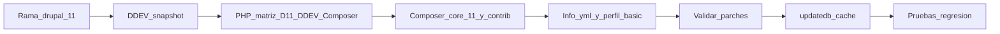

# Plan: actualizar a Drupal 11 (última estable)

## Punto de partida

- **Core instalado (lock):** [`drupal/composer.lock`](drupal/composer.lock) — `drupal/core-recommended` **10.6.8**.
- **Restricciones Composer:** [`drupal/composer.json`](drupal/composer.json) — `drupal/core-recommended`, `drupal/core-composer-scaffold` y `drupal/core-dev` en **`^10.4`**; `php` hoy **`>=8.2`** (se subirá al rango exigido por D11 y, si la matriz lo permite, a la última PHP estable soportada).
- **DDEV:** [`.ddev/config.yaml`](.ddev/config.yaml) — hoy **`php_version: "8.3"`**, `composer_root: drupal`, proyecto `next-drupal-starterkit`. Para D11 hay que cumplir el **mínimo** de core (8.3+) y, si procede, **subir a la última PHP estable que Drupal 11 declare compatible** (p. ej. 8.4 cuando figure en la matriz oficial), no una versión que core aún no soporte.
- **Parches Composer** (revisar tras el salto de major): `subrequests`, `paragraphs`, `graphql` (GitHub), `webform_rest` — ninguno sobre core en el JSON actual (menos fricción que planes antiguos con parche de core).
- **Riesgo principal no-Composer:** el perfil [`drupal/web/profiles/custom/basic/basic.info.yml`](drupal/web/profiles/custom/basic/basic.info.yml) declara `core_version_requirement: ^9` e instala módulos/temas **retirados del core** en instalaciones modernas (`ckeditor`, `bartik`, `seven`). Eso bloquea o rompe **instalaciones nuevas** y es señal de deuda; para D11 hay que **actualizar el perfil** (requisito de core y lista `install` / `themes` acorde a core 10+/11: editor/ckeditor5, temas existentes como Claro/Olivero según decisión del equipo).

## Orden de ejecución (como pediste)

### 1. Rama Git `drupal-11`

Desde la rama base acordada del repo (p. ej. `main` o la que uséis como fuente de verdad):

- `git fetch` y `git checkout <rama-base>`
- `git pull` (si aplica)
- `git checkout -b drupal-11`

Así todo el trabajo de Composer, `composer.lock`, YAML custom y posibles fixes queda aislado en esa rama.

### 2. Copia de base de datos con DDEV snapshot

En la **raíz del repo** (donde está `.ddev/`):

- `ddev snapshot --name next-starterkit-pre-d11-2026-05-13` (o el nombre que prefieráis; mantener prefijo + fecha + sufijo `-v2` si repetís el mismo día).
- Verificar: `ddev snapshot --list`
- Rollback si hace falta: `ddev restore-snapshot <nombre>`

El snapshot cubre el estado de la BD del proyecto DDEV; no sustituye un backup de `files` si lo necesitáis para otro entorno.

### 3. PHP: última versión compatible con Drupal 11

Antes del `composer update` de core (o justo después de cambiar `composer.json` pero antes de resolver dependencias), **no** subir PHP “a ciegas”: usar la [matriz de requisitos de PHP del proyecto Drupal](https://www.drupal.org/docs/system-requirements/php-requirements) y la release concreta de **Drupal 11.x** que vayáis a instalar (mínimo y máximo soportados suelen actualizarse entre minors).

1. Elegir la **última versión MINOR de PHP** que sea **explícitamente compatible** con esa versión de core (ej. si la matriz incluye 8.4, preferir 8.4 sobre 8.3).
2. En [`.ddev/config.yaml`](.ddev/config.yaml), poner `php_version` al valor que DDEV soporte y coincida con esa elección (comprobar con `ddev help` / documentación DDEV si la versión existe en vuestro DDEV).
3. En [`drupal/composer.json`](drupal/composer.json), actualizar el requisito `"php": ...` para que refleje el **mínimo** de Drupal 11 (típicamente `>=8.3`) y, si el equipo quiere acotar al rango probado, un tope acorde a la matriz (p. ej. `>=8.3 <8.5` mientras 8.4 sea el máximo soportado).
4. `ddev restart` para que Composer y Drush corran ya con la nueva versión.

Si alguna dependencia (contrib, `wunderio/*`, extensiones PECL, etc.) **no** soporta aún la PHP elegida, Composer fallará: entonces bajar un escalón de PHP **dentro** de la matriz de Drupal 11 o actualizar la dependencia bloqueante.

### 4. Actualizar core y módulos (Composer + metadatos)

**4.1 Cambiar restricciones de core a 11.x** en [`drupal/composer.json`](drupal/composer.json):

- `drupal/core-recommended`, `drupal/core-composer-scaffold`: **`^11`**
- `drupal/core-dev` (require-dev): **`^11`**
- El requisito **`php`** se ajusta en el paso anterior (sección 3); no dejar `>=8.2` si el runtime y core exigen 8.3+.

**4.2 Actualización de dependencias**

- Desde el directorio **`drupal/`** (es el `composer_root` de DDEV):
  `ddev composer update "drupal/core-*" drush/drush --with-all-dependencies`
  y ampliar según conflictos, p. ej. `wunderio/drupal-ping`, `wunderio/code-quality`, cliente Elasticsearch, etc., hasta que no queden paquetes bloqueando la resolución a **última 11.x** estable.

**4.3 Contrib y betas**

- Paquetes en beta (`monolog`, `simplei`) pueden exigir revisión de releases compatibles con 11 o sustitución; Composer indicará el bloqueo concreto (`composer why-not ...`).

**4.4 Parches**

- Tras resolver versiones, ejecutar de nuevo `composer install` / `update` y comprobar que los parches en `extra.patches` siguen aplicando; si fallan, buscar issue/release nuevo o eliminar el parche si el fix ya está upstream.

**4.5 Código custom (obligatorio para que el proyecto “declare” D11)**

Actualizar `core_version_requirement` en:

- [`drupal/web/modules/custom/wunder_next/wunder_next.info.yml`](drupal/web/modules/custom/wunder_next/wunder_next.info.yml)
- [`drupal/web/modules/custom/wunder_search/wunder_search.info.yml`](drupal/web/modules/custom/wunder_search/wunder_search.info.yml)
- [`drupal/web/modules/custom/wunder_sitemap/wunder_sitemap.info.yml`](drupal/web/modules/custom/wunder_sitemap/wunder_sitemap.info.yml)
- [`drupal/web/modules/custom/wunder_democontent/wunder_democontent.info.yml`](drupal/web/modules/custom/wunder_democontent/wunder_democontent.info.yml)

Patrón habitual: **`^10 || ^11`** (o el rango mínimo que aceptéis soportar). El tema [`drupal/web/themes/custom/wunder_claro/wunder_claro.info.yml`](drupal/web/themes/custom/wunder_claro/wunder_claro.info.yml) ya declara `^10 || ^11`.

**4.6 Perfil `basic`**

- Subir `core_version_requirement` y **reemplazar** entradas obsoletas en `install`/`themes` por lo que realmente use el producto en D11 (p. ej. editor moderno, temas de admin/front que existan en core/contrib). Esto es el punto más delicado si alguien reinstala desde cero; en un sitio ya existente, igual conviene alinearlo en la misma rama para no arrastrar inconsistencias.

### 5. Base de datos y caché (tras Composer)

Con DDEV levantado y en `drupal/web` o vía `ddev drush`:

- `drush updatedb -y`
- `drush cache:rebuild`

Revisar mensajes de update hooks y warnings de módulos obsoletos.

### 6. Comprobaciones mínimas (alineado al starter)

- GraphQL / GraphQL Compose / preview y `decoupled_router`
- `simple_oauth` y flujos Next
- Elasticsearch (`elasticsearch_helper` + índices)
- Webform / `webform_rest`
- Admin con tema custom Claro

### 7. Entrega

- Commit en `drupal-11`: `composer.json`, `composer.lock`, [`.ddev/config.yaml`](.ddev/config.yaml) si cambió `php_version`, cambios en `.info.yml` / perfil, y ajustes de parches solo si hicieron falta.
- Opcional: nota breve con versión final de `drupal/core` y parches retirados o reemplazados.

## Referencia oficial

- Seguir la guía de actualización mayor de Drupal (10 → 11) en [Drupal.org documentation](https://www.drupal.org/docs/upgrading-drupal) para requisitos de PHP, Symfony y pasos de post-actualización.
- Requisitos de PHP (versiones mínima y máxima soportadas): [PHP requirements](https://www.drupal.org/docs/system-requirements/php-requirements).
